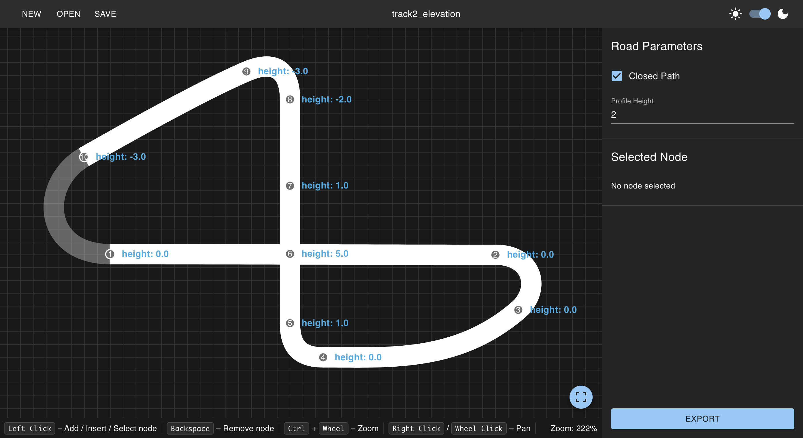

<h1 align="center">Racetrack Creator 3D</h1>

<p align="center">
    A browser-based editor for designing racetracks and generating 3D road meshes.
    <br>
    <a align="center" href="https://racetrack-creator-3d.vercel.app">Explore the Live Demo</a>
</p>



## 📖 Project Overview

**Racetrack Creator 3D** is a web-based procedural content generation (PCG) tool designed to streamline the creation of 3D racing circuits. Built entirely on frontend technologies, it allows designers and game developers to procedurally generate clean, game-ready road meshes from mathematical curves and export them directly into standard 3D pipelines.

### Key Features

- **Spline Editor**: Design complex, continuous circuit shapes using cubic Bézier control nodes.
- **Dynamic Road Width**: Adjust the road width dynamically along the curve by setting individual width parameters per control node.
- **3D Preview**: Inspection of the generated polygonal mesh prior to export.
- **Robust Project Management**: Create, save, and resume work via JSON-based project files.
- **Production-Ready Export**: Seamlessly export assets into standard 3D formats (**OBJ**, **GLTF/GLB**) or 2D vector layouts (**SVG**).
- **Adaptive UI**: Fully optimized user interface featuring native Light and Dark mode themes.


## 💡 Mathematical Model

The core of the mesh generation pipeline relies on a robust geometric framework that treats the track mesh as an approximation of a kinematic surface.

### 1. Track Trajectory (Bézier Splines)
The track centerline is modeled using parametric cubic Bézier curve. This provides geometric continuity ($G^2$ or $C^2$), ensuring smooth transitions through corners and elevation changes.

### 2. Mesh Generation (Sweep Surface & Affine Transformations)
The system implements a **Sweep Surface** method:
- A predefined cross-section (the road profile) is swept along the parametric path.
- For each step along the path, a local coordinate frame is calculated using the curve's position and tangent vectors.
- An **affine transformation matrix** is constructed to translate and rotate the profile to match the calculated frame and to scale its width.

## 🛠 Tech Stack

- **React** with **TypeScript**
- **Vite** for development and production builds
- **Material UI** for the interface
- **Three.js** for mesh preview and export
- **Zod** for project file validation

## 🚀 Getting Started

### Prerequisites

- [Node.js](https://nodejs.org/) 20+ recommended
- `npm` (bundled with Node.js)

### Installation

1. **Install dependencies**

   ```bash
   npm install
   ```

2. **Start the development server**

   ```bash
   npm run dev
   ```

3. **Open the app**

    - Local app: [http://localhost:5173/](http://localhost:5173/)

### Useful Commands

```bash
npm run build
npm run preview
npm run lint
```

## 🕹️ Usage Workflow

- **Initialize:** Start fresh or import an existing `.json` track configuration file.
- **Shape Layout:** Manipulate the control points and tangents in the editor viewport.
- **Refine Profiles:** Select individual nodes to fine-tune local properties like road width, elevation, and pitch.
- **Export to 3D:** Save the generated polygons as a `.obj` or `.gltf`/`.glb` asset directly into game engines (Unity, Unreal, Godot) or DCC tools (Blender, Maya).
- **Export to 2D:** Save the track as a `.svg` image, that can be used as a minimap in a game.